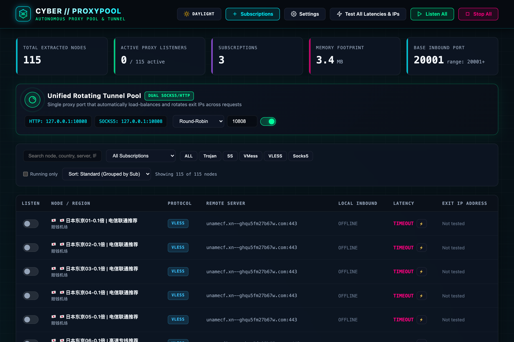
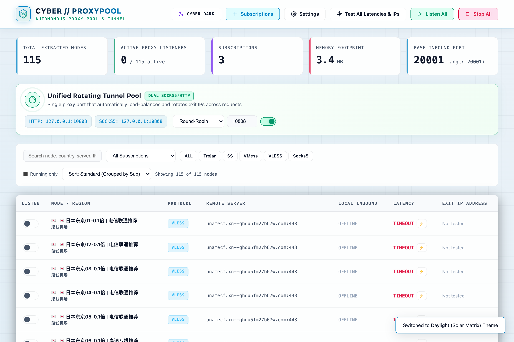
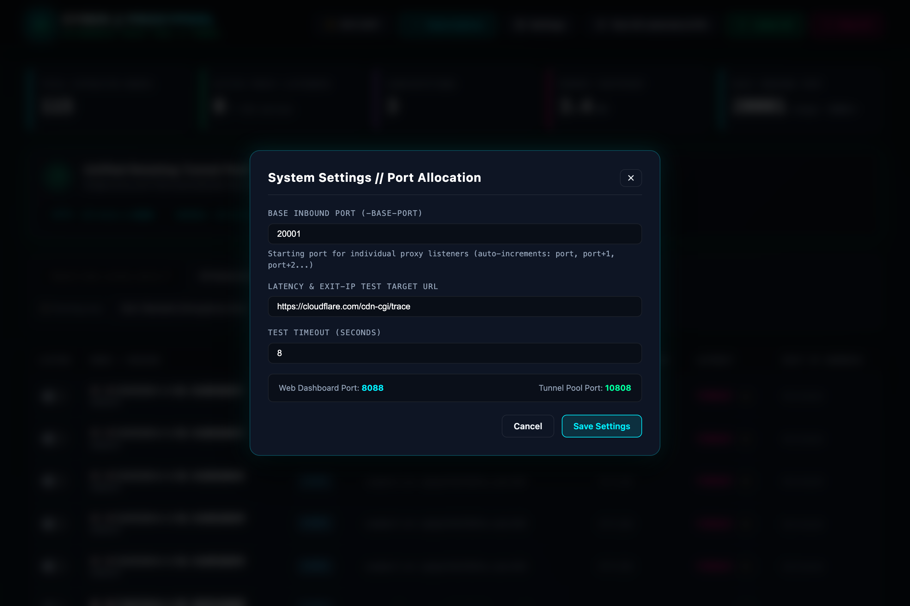

# CyberProxyPool ⚡

<div align="center">
  
  <h3>Autonomous Single-Binary Proxy Pool &amp; Rotating Tunnel Engine</h3>
  <p>Modern • Cyber Dark &amp; Daylight Themes • Zero External Dependencies • Instant Deploy</p>

  <p>
    <a href="#-web-ui-preview"></a>
    <a href="#-core-features"></a>
    <a href="#-quick-start"></a>
    <a href="#-acknowledgments--reference"></a>
  </p>
</div>

---

## 📸 Web UI Preview

### Cyber Dark Theme


### Daylight (Solar Matrix) Theme


### System Settings & Dynamic Base Port Modal


---

## 🌟 Highlights & Comparison with Legacy `v2raypool`

| Feature | Legacy `v2raypool` | **CyberProxyPool** |
| :--- | :--- | :--- |
| **Deployment** | Requires manual zip download of external `v2ray-core`, `.env` config, multiple binaries | **Single standalone binary** with embedded Cyber Web UI (`//go:embed`). Zero external runtime dependencies! |
| **Web UI** | Traditional HTML table forms | **High-Tech Cyber UI** with glassmorphism, instant Daylight / Dark switcher, custom vector cyber favicon, live SSE telemetry |
| **Node List Sorting** | Random / fluctuating order | **Deterministic Standard Sorting**: Grouped by subscription with natural alphanumeric ordering (`01`, `02`, `10`). **In-place status updates** ensure rows never jump or shift during speed tests! |
| **Port Configuration** | Fixed at launch via flags / `.env` | **Dynamic Base Port (`-base-port`) Management**: View and modify the starting listener port directly from the Web UI Settings modal in real time! |
| **Protocols Supported** | Limited (Trojan only in Clash) | **Full Next-Gen Suite**: VLESS (XTLS Vision `xtls-rprx-vision` & WS), VMess (AEAD), Trojan (TCP/WS/TLS), Shadowsocks (AEAD), Socks5, HTTP |
| **Inbound Protocol** | Separate HTTP or Socks port | **Dual-Protocol Inbound**: SOCKS5 and HTTP CONNECT auto-detected simultaneously on the **exact same port** |
| **Unified Tunnel Pool** | Basic tunnel | **Smart Rotating Tunnel Pool** with Round-Robin, Random, and Lowest-Latency dynamic routing |
| **Exit IP & Speed Test** | Basic TCP handshake | **Global Anycast Edge Latency & True Exit-IP Detection**: Supports both IPv4 and IPv6 exit addresses |
| **Subscription Management** | Single file / URL | **Multi-Subscription Manager** with one-click refresh, custom labels, raw Clash YAML paste, and base64 decoding |

---

## 🚀 Quick Start

### 1. Build from Source
Ensure you have Go 1.22+ installed:
```bash
# Clone the repository
git clone https://github.com/blackTDE/cyber-proxypool.git
cd cyber-proxypool

# Compile single standalone binary with embedded web dashboard
go build -o bin/cyberproxypool -trimpath -ldflags="-s -w" .
```

### 2. Run the Service
```bash
# Run with default settings (Web UI on :8088, Tunnel on :10808, Node inbounds from :20001)
./bin/cyberproxypool

# Or customize ports:
./bin/cyberproxypool -port 8088 -tunnel-port 10808 -base-port 20001 -data-dir ./data
```

### 3. Access Web Dashboard
Open your browser at:
👉 **[http://127.0.0.1:8088](http://127.0.0.1:8088)**

---

## ⚡ Core Features

1. **One-Click Subscription Import**:
   - Click **"Subscriptions"** ➡️ Paste your subscription URL (Clash YAML or Base64 link).
   - Or paste raw Clash YAML text / node URI lines directly into the textarea.
   - Nodes are automatically parsed, geo-tagged with country flags (🇭🇰, 🇯🇵, 🇺🇸, 🇸🇬, 🇪🇸, etc.), and listed in the dashboard.

2. **Stable Deterministic Sorting**:
   - Nodes are grouped by subscription and sorted by natural numeric name (`01`, `02`... `10`).
   - Filter by protocol (`Trojan`, `SS`, `VMess`, `VLESS`, `Socks5`), subscription, or search query.
   - Status changes (speed tests, starting, stopping) update rows **in-place** so node positions never jump or rearrange unexpectedly.

3. **Dynamic Base Port Setting**:
   - Open **"Settings"** in the top navigation bar to adjust the **Base Inbound Port (`-base-port`)** on the fly without restarting the service.
   - Real-time metric card displays active port ranges (e.g. `20001+`).

4. **Daylight & Cyber Dark Themes**:
   - Toggle seamlessly between the high-contrast **Solar Daylight** theme and the futuristic **Cyber Dark** theme with a single click.
   - Preferences are automatically saved in `localStorage` and respect OS system preferences.

5. **Unified Rotating Tunnel Pool (`127.0.0.1:10808`)**:
   - Acts as a single proxy entry point for web scrapers and crawlers.
   - Automatically load-balances and rotates exit IPs per request across active nodes:
     - **Round-Robin**: Sequentially cycles through nodes.
     - **Random**: Randomly selects an active node per connection.
     - **Lowest Latency**: Dynamically routes traffic through the lowest latency tested node.

6. **Concurrent Latency & True Exit-IP Verification**:
   - Click **"Test All Latencies & IPs"** to test node reachability against Cloudflare edge.
   - Accurately captures both IPv4 and IPv6 egress addresses and displays response latency in milliseconds.

---

## 💻 Programmatic Usage & Scrapers

### Using Individual Node Inbounds
Each running node listens on an assigned port (e.g. `20001`, `20002`):
```bash
# Using HTTP Proxy
curl -x http://127.0.0.1:20001 https://cloudflare.com/cdn-cgi/trace

# Using SOCKS5 Proxy on the exact same port!
curl -x socks5h://127.0.0.1:20001 https://cloudflare.com/cdn-cgi/trace
```

### Using the Unified Rotating Tunnel Pool
```bash
# Request 1 (Routes to Node A)
curl -x http://127.0.0.1:10808 https://cloudflare.com/cdn-cgi/trace

# Request 2 (Routes to Node B - new exit IP!)
curl -x http://127.0.0.1:10808 https://cloudflare.com/cdn-cgi/trace

# In Python:
import requests
proxies = {"http": "http://127.0.0.1:10808", "https": "http://127.0.0.1:10808"}
resp = requests.get("https://cloudflare.com/cdn-cgi/trace", proxies=proxies)
print(resp.text)
```

---

## 📡 REST API Reference

| Method | Endpoint | Description |
| :--- | :--- | :--- |
| `GET` | `/api/status` | System health, memory, uptime, base port, and active node counts |
| `GET` | `/api/config` | Retrieve system configuration (base port, test URL, timeout) |
| `POST` | `/api/config` | Update system configuration (e.g. change `base_inbound_port` dynamically) |
| `GET` | `/api/subscriptions` | List all subscriptions |
| `POST` | `/api/subscriptions` | Add subscription via URL or raw content |
| `DELETE` | `/api/subscriptions/:id` | Delete subscription and associated nodes |
| `POST` | `/api/subscriptions/:id/refresh` | Refresh subscription from remote URL |
| `GET` | `/api/nodes` | List nodes (sorted deterministically; supports query filters) |
| `POST` | `/api/nodes/start-all` | Start all proxy inbounds |
| `POST` | `/api/nodes/stop-all` | Stop all proxy inbounds |
| `POST` | `/api/nodes/test-all` | Concurrently test latency and exit IPs for all nodes |
| `POST` | `/api/nodes/:id/start` | Start individual node listener |
| `POST` | `/api/nodes/:id/stop` | Stop individual node listener |
| `POST` | `/api/nodes/:id/test` | Test single node latency and exit IP |
| `GET` | `/api/tunnel` | Get rotating tunnel configuration and status |
| `POST` | `/api/tunnel` | Update tunnel port, strategy, or state |
| `GET` | `/api/events` | Server-Sent Events (SSE) stream for real-time updates |

---

## 🛠️ Architecture & Tech Stack

- **Backend**: Go 1.22+ (High-performance non-blocking netpoll goroutines)
- **Protocols Supported**: VLESS (XTLS Vision & WS), VMess (AEAD), Trojan (TCP/WS/TLS), Shadowsocks (AEAD), SOCKS5, HTTP
- **Inbound Engine**: Custom dual-protocol detector for simultaneous HTTP CONNECT & SOCKS5 on identical ports
- **Frontend**: Responsive modern cyber dashboard with embedded static assets (`embed.FS`)
- **Persistence**: Atomic thread-safe JSON storage engine with write-lock synchronization

---

## 🤝 Acknowledgments & Reference

Special thanks and tribute to the original open-source project **[v2raypool](https://github.com/iotames/v2raypool)** by [@iotames](https://github.com/iotames).

The conceptual idea of aggregating multiple subscription nodes into local listeners and providing a rotating proxy pool was inspired by `v2raypool`. **CyberProxyPool** reimagines this concept for modern infrastructure:
- Eliminates the need for external `v2ray-core` binary downloads and multi-process subprocess management by utilizing a pure, embedded Go network core.
- Consolidates everything into a **single, portable, zero-dependency binary**.
- Introduces an intuitive **Cyber Dark & Daylight** web interface designed for ease of use, observability, and automated scraper pipelines.

---

## 📄 License

MIT License © 2026 [blackTDE](https://github.com/blackTDE/cyber-proxypool)
